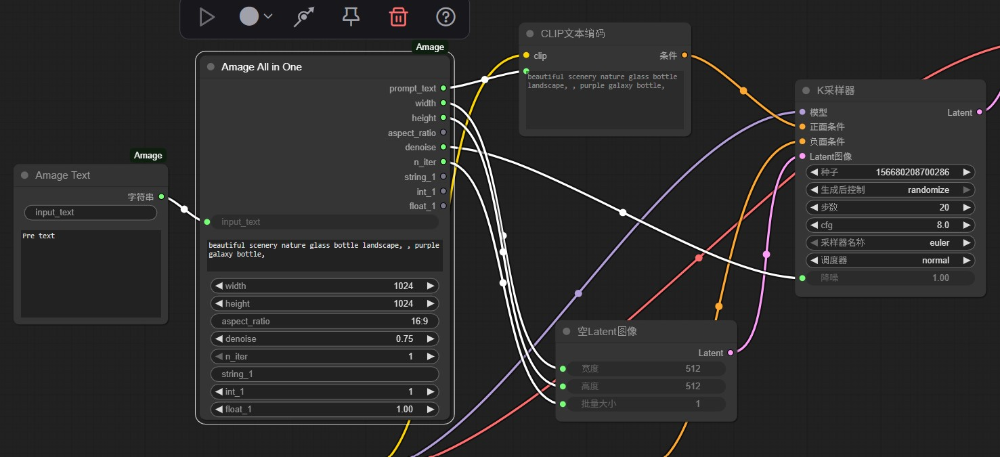

# Amage ComfyUI Custom Nodes

[](https://registry.comfy.org/nodes/amage)
[](https://opensource.org/licenses/MIT)

This repository provides a set of custom nodes for
[ComfyUI](https://github.com/comfyanonymous/ComfyUI), designed to
improve workflow convenience when working with text, image, video, and
audio data.

## 📦 Nodes Overview

### 1. Amage Text (`AmageTextNode`)

A simple text input node.
- Allows users to add prompt texts or other strings.
- Provides an `input_text` field to concatenate extra text into the
node.
- A typical use case is adding LoRA trigger words in front of the main
prompt.

### 2. Amage All in One (`AmageOneNode`)

An extended version of the text node that bundles multiple generation
parameters into one place.
- Centralizes common inputs needed for AI image or video generation,
such as:
- Prompt text
- Image width & height
- Aspect ratio
- Denoise value
- Iteration count
- Includes three customizable inputs (string, integer, float) for more
flexible usage.
- Each parameter is also available as an individual output.

### 3. Amage FPS Converter (`AmageFpsConverterNode`)

A video utility node for adjusting frame rate (FPS).
- Inputs: `original_fps`, `target_fps`, and `method`.
- Methods available:
- **downsample** (reduce FPS by skipping frames)
- **duplicate** (increase FPS by repeating frames)
- **interpolate** (smoothly increase FPS by interpolating frames)

### 4. Amage STT (`AmageSTTNode`)

A speech-to-text (STT) node powered by
[Whisper-tiny](https://github.com/openai/whisper).
- Converts input audio into text.
- Automatically searches for the model at:
`models/sonic/whisper-tiny`
- Supports automatic language detection (`language="auto"`) or manual
specification.

---

## 📸 Screenshots
Here are some examples of the nodes inside ComfyUI:

### Amage Text & Amage All in One


### Amage FPS Converter & Amage STT


---

## 🔧 Installation

### Method 1: Via ComfyUI-Manager (Recommended)
1. Search for **"Amage"** in the Custom Nodes Manager.
2. Click **Install**.
3. Restart ComfyUI.

### Method 2: Manual Installation
1.  Clone or download this repository into your ComfyUI `custom_nodes`
    folder:

    ``` bash
    git clone https://github.com/Sampkao/ComfyUI-Amage.git
    ```

2.  Restart ComfyUI.

3.  The new nodes will appear under categories like **Amage/Audio**,
    **Amage/Video**, and **Text**.

[!IMPORTANT] For Amage STT Node: > Please ensure the Whisper model is placed at: ComfyUI/models/sonic/whisper-tiny. You may need to create these folders manually.
------------------------------------------------------------------------

## 📜 License

MIT License. Feel free to use, modify, and share.
